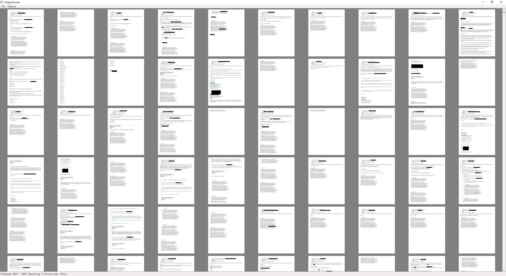
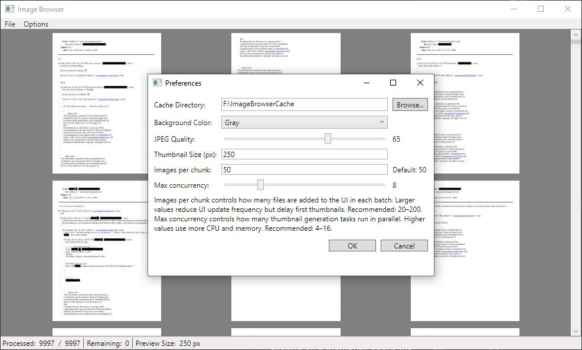

# ImageBrowser

No frills image browser. Designed to quickly cache thumbnails for folders that contain thousands of images.

+/- Changes thumbnail preview size.

Clicking on a thumbnail opens the full image, left and right arrows can be used to navigate here.
